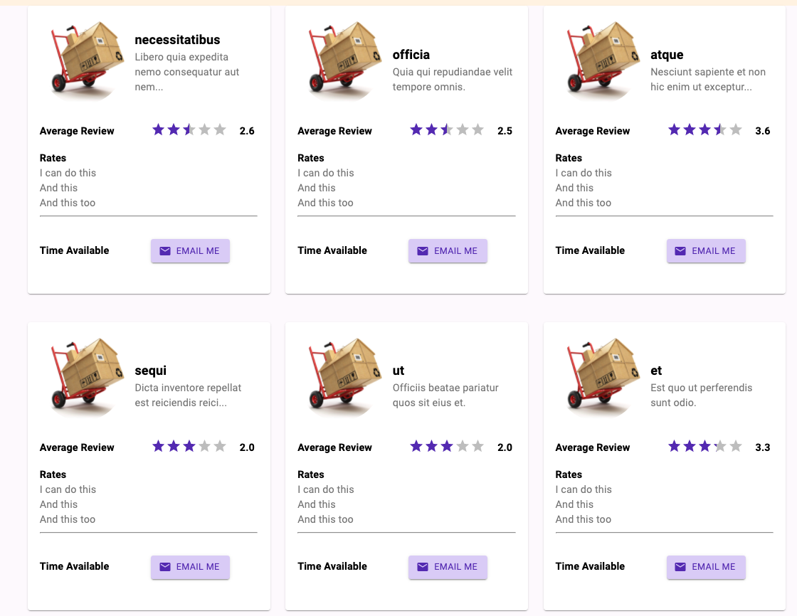
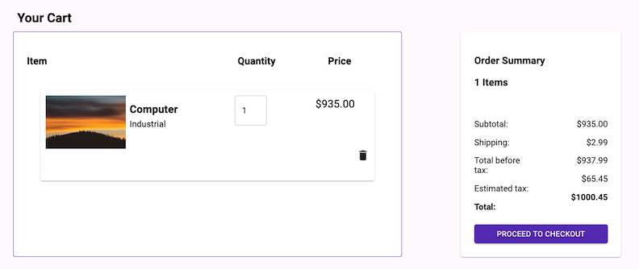

<h1 align="center" style="font-size: 2.7rem;">Odds 'n' Ends</h1>

<h2 align="center" style="font-size: 1.5rem;">A C2C e-commerce marketplace focused on local products, local services, and community  

****

## Table of Contents

- [Overview](#Overview)
- [Technologies Used](#Technologies-Used)
- [Planning](#Planning)
- [Frontend Features](#Frontend)
- [Server Routes](#Server)
- [Database](#Database)
- [Workflow](#Workflow)
- [Challenges and Learning](#Challenges-and-Learning)
- [Contributors](#Contributors)

## Overview
- Established client side routing utilizing **React Router** library coupled with Node Express server for **Server Side routing**
- Styled using **Material-UI** and CSS global variables, compiled with Webpack
- Optimized **Mongo** database queries by using collections with  **nested arrays**
- Reduced prop drilling by using  **Zustand** as a state manager
- Used **Model, View, Controller (MVC)** architecture, improving separation of concerns and modularity
- Implemented **agile methodologies** to coordinate 12 engineers across 2 time zones -  daily stand ups, code reviews, and GitHub workflow

## Technologies Used
- [React](https://reactjs.org/)
- [Material-UI](https://material-ui.com/)
- [Node.js](https://nodejs.org/en/)
- [Express](https://expressjs.com/)
- [MongoDB](https://www.mongodb.com/)
- [AWS](https://aws.amazon.com/)

## Planning

### Wire Diagram

- We utilized **Figma** to create a wire frame of the user interface.

  

### Architecture Planning

- We used **Miro** to design our system architecture

  

### Tickets and work management

- We used **Trello** to organize tickets and assign work

  

## Frontend Features:
- Landing Page: Consists of an auto-scrolling banner, a products carousel, and a services carousel (see image at top of document)

- Sign-up Page: A modal window for signing up as a buyer

    

- Navigation Bar: Contains a link to checkout, link to sign in, a search bar, and locaiton information

- Service and Product Result Pages: Displays results of relevant search queries

- Product Details: Displays product information, the ability to add to card, and the ability to instantly check out

    

- Cart: Aggregates all selected items for checkout

    

## Server Routes:
Process:
During construction, each route's backend engineer communicated with the corresponding frontend engineer to ensure that the correct data was being sent by the server. We also updated our database schema multiple times, after realizing that data we needed wasn't being stored in an easily accessible way.

Primary routes:
- GET /landing: Data for the landing page
- GET /sign-in: Retrieve user information on sign in
- GET /search: Retrieve results of search query
- GET /checkout: Items for checkout and purchase
- GET /product-details: Details for clicked product
- GET /products: List of of all product categories
- GET /services: List of all services categories
- POST /sign-in: Post user sign-up information to the database
- POST /orders: Post order data to the database

## Database:
We chose a document based database (MongoDB) rather than a relational database, because we wanted to maximize the flexibility of our developers to reshape the data as needed. We didn't want to be 'frozen' into pre-defined tabular or relational structure.
- Early in the development process, we were uncertain what data would ultimately be stored (or what shape the data would take)
- Additionally, we wanted to store nested arrays and objects in the database, and found this easier to accomplish with Mongo (compared to MySQL)
- Finally, we were worried that complex table joins and aggregation functions might make our database queries less performant. Using Mongo (with nested arrays and objects directly inside inside each document) allowed us to keep our database queries relatively straight-forward

To view our database schema, click on the index.js file inside the 'database' folder

## Workflow:
To simplify and systematize our workflow, we followed the below process when making git commits:

1) Pull updates from development
`git pull origin dev`

2) Create feature branch with
     Service_ticket#
`git checkout -b <service_ticket#>`

3) Commit/push / save regularly to feature branch
`git add, git commit, etc`

4) Commit/push to feature branch EOD every day
`git push origin <branchname: branchname>`

5) In order to combine on development branch:
 a) Checkout local development branch
  `git checkout dev`
 a) Pull updates from development
  `git pull origin dev`
 b) Merge to identify conflicts
  `git checkout <featureBranch>`
  `git merge dev`
 c) Resolve conflicts with owner of conflicting code
  (conflicts will be in the file structure - review and make any changes with involved developers)
 d) Push new changes to gitHub branch
  `git push origin <branchname: branchname>`
 e)Pull request end of feature development (Architect or PM code  review before approval)
  (be sure to select the correct branchname that is getting merged into DEV, not MAIN)

## Challenges and Learning:
- Ticket management: This project has 12 contributors split accross 2 time zones, making co-ordination difficult
- Ticket size estimates: Some technologies in the project (such as Zustand) were new to most team members. Some team members also worked on parts of the tech stack that they were less familiar with. The combination of these 2 factors sometimes made ticket time estimates difficult
- Frontend-backend communication: Front-end and back-end tickets were worked on simultaneously and in parallel. As a result, the responses sent by the server to the front-end sometimes turned out to be missing missing needed data (or to be in an unexpected shape). This problem could have been avoided with earlier communication between the front-end and back-end ticket owners of a particular route

## Contributors:

<table>
  <tr>
    <td align="center"><a href="https://github.com/nickknowles1"> <b>Nick Knowles</b></a> </td>
    <td align="center"><a href="https://github.com/thejasondye"> <b>Jason Dye</b></a> </td>
    <td align="center"><a href="https://github.com/Yuki-1025"> <b>Yunqi Li</b></a> </td>
    <td align="center"><a href="https://github.com/swizzlestix09"> <b>Angely Rodriguez</b></a> </td>
    <td align="center"><a href="https://github.com/apoolinaria"> <b>Polina Chebanenko</b></a> </td>
    <td align="center"><a href="https://github.com/pjones2012"> <b>Portia Jones</b></a> </td>
    <td align="center"><a href="https://github.com/camboucher"> <b>Cam Boucher</b></a> </td>
    <td align="center"><a href="https://github.com/eringrisham"> <b>Erin Grisham</b></a> </td>
    <td align="center"><a href="https://github.com/jdtodd"> <b>Joshua Todd</b></a> </td>
    <td align="center"><a href="https://github.com/alang98"> <b>Alan Guerrero</b></a> </td>
    <td align="center"><a href="https://github.com/TN423"> <b>Justin Hurst</b></a> </td>
     <td align="center"><a href="https://github.com/7u1ian"> <b>Jason Chen</b></a> </td>

  </tr>
</table>
